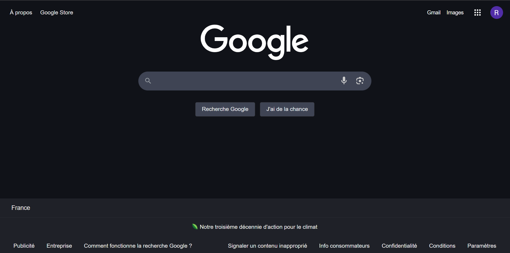

# Google-challenge

the challenge is to reproduce the Google search website as per picture below:


using :

* flexbox
* padding/margin
* border, color, hover...

Then we save the project on github.

utiliser flexbox pour body.
flex direction inutile pour footer
justify-content: space-between;
faire dossier pour images
input search bar
hauteur footer
shadow bar search

[test](test.com)

```css
body{
  
}
```
